Cloudy day that day, but beautiful none the less. This hike is the textbook definition of "it's not
about the destination, it's about the journey".

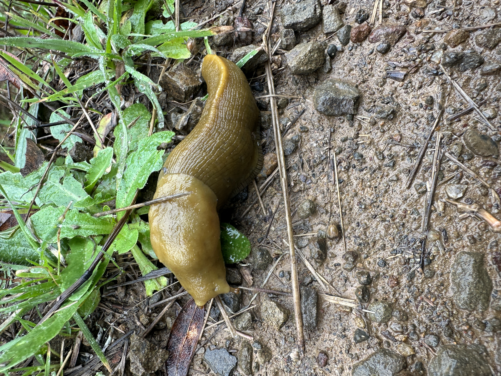
:::Note
Haven't seen one since Science Camp!
:::
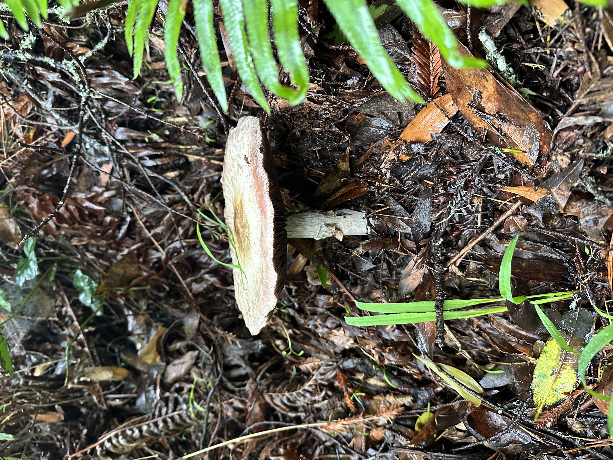

:::WARNING
Yummy Looking
:::

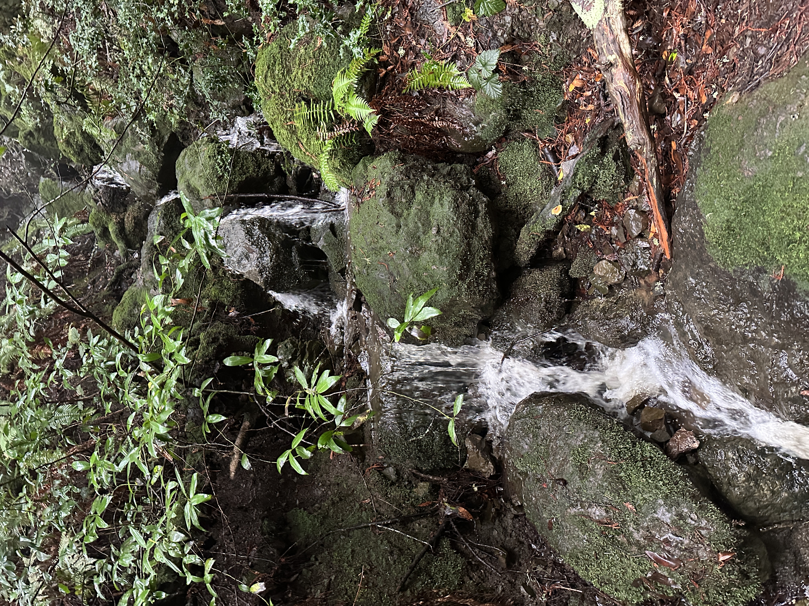
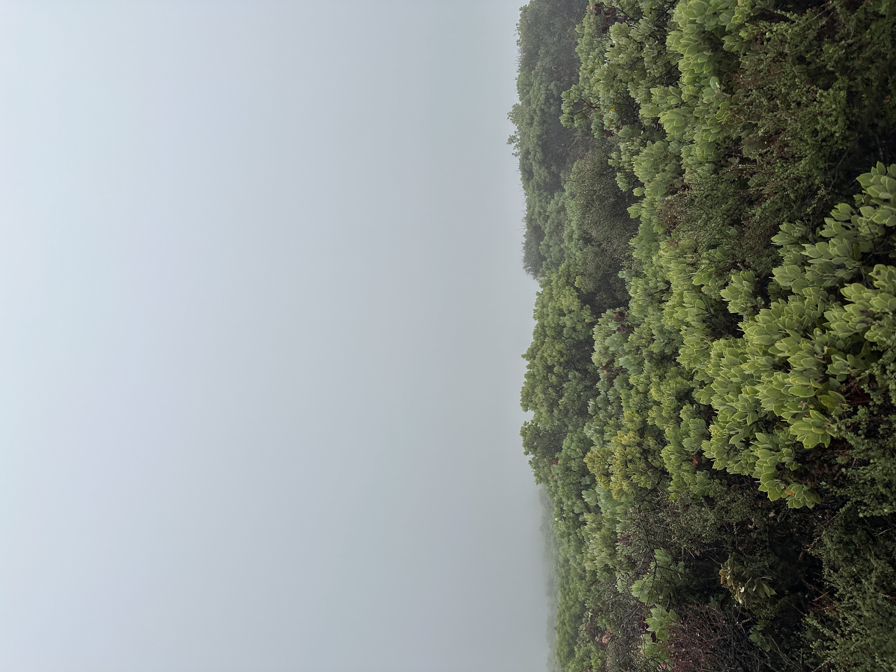
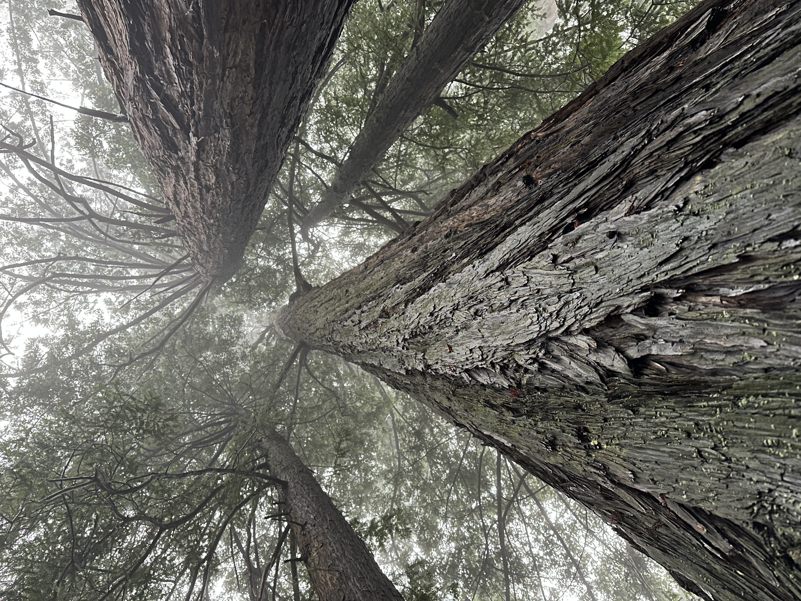

:::Note
Did you know some Redwoods share roots with each other? That means that these guys could be the same
tree!
:::

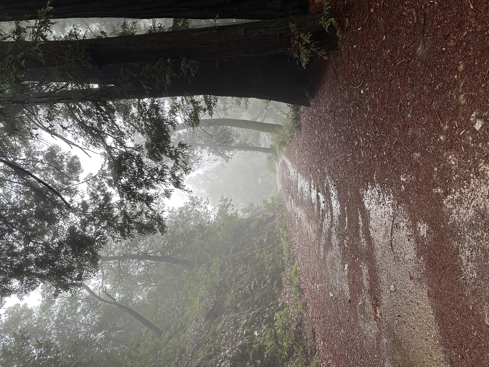
:::note
I love the Fog!
:::
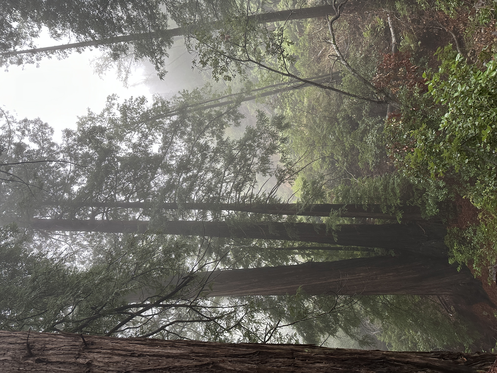
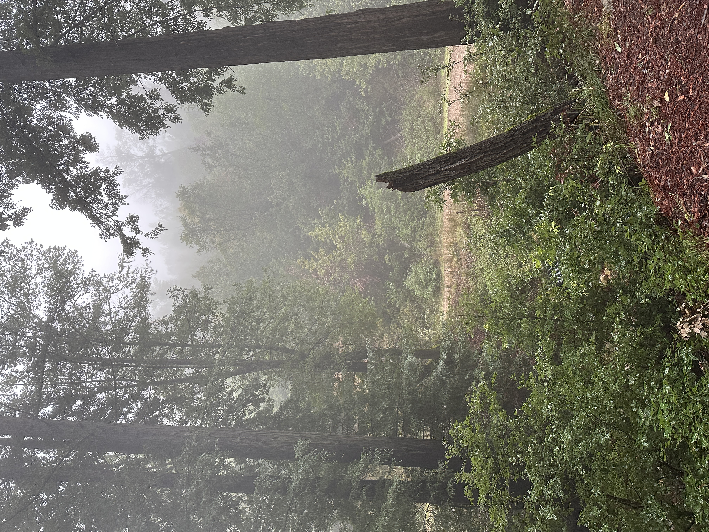
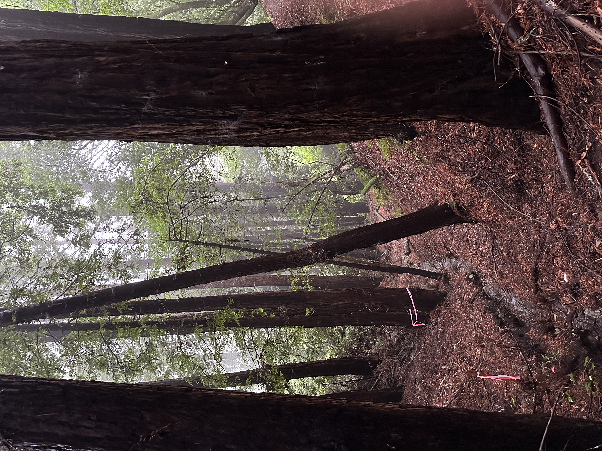
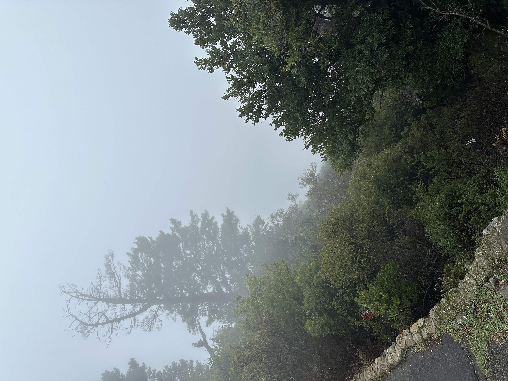
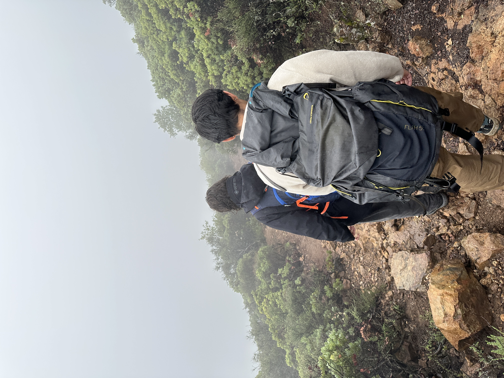
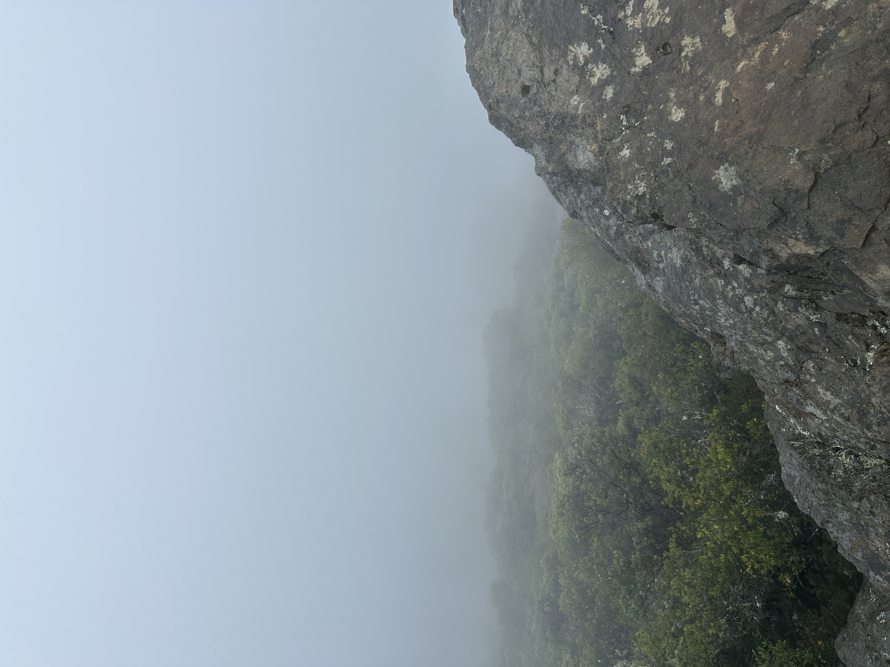

Really Mid Peak 

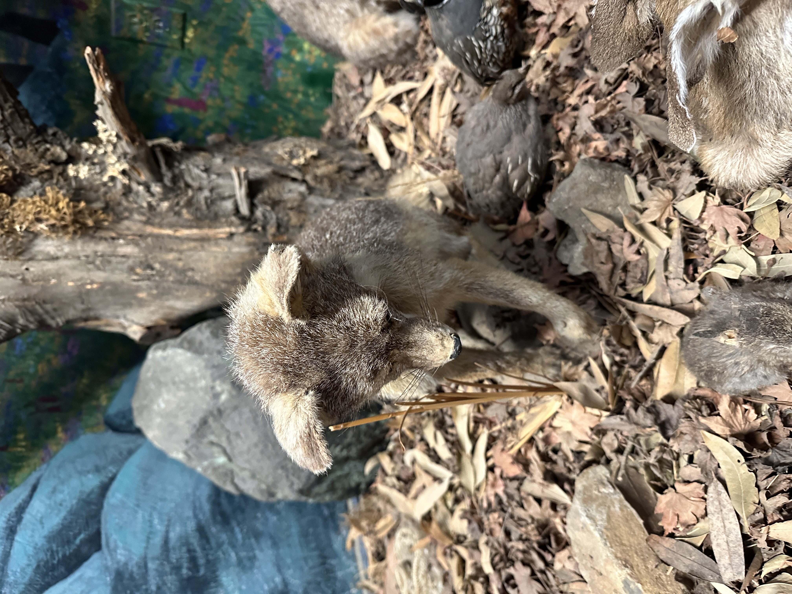
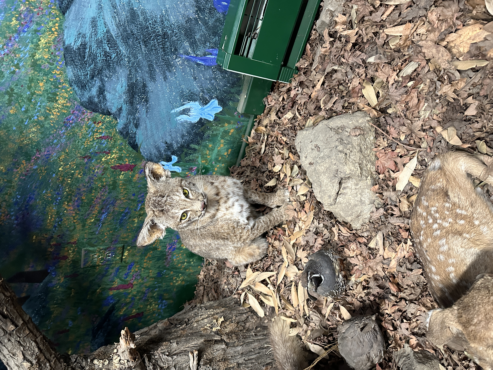
